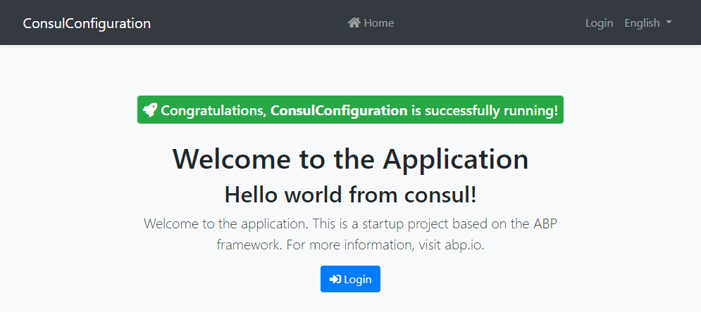

# Neco.Abp.ConsulConfiguration

This project demonstrates how to configure a aspnet-core application by utilizing consul.
Since I plan to integrate this feature into the [ABP Framework](https://github.com/abpframework/abp), this solution is powered by ABP.



## How to run

Considering you're in the repository root, just run the following commands:

1. Launch consul cluster

    - `cd services/consul`
    - `docker compose up -d`

2. Launch MySQL database

    - `cd services/mysql`
    - `docker compose up -d`

3. Create key in [consul at http://localhost:8500/ui/dc1/kv](http://localhost:8500/ui/dc1/kv).
    > If the web UI isn't available yet, just wait a few seconds until the cluster has been fully initialized.

    - Add a new Key `MyKey` and add the following payload:

    ```json
    {
        "Main": "Hello world from consul!"
    }
    ```

4. Start the project

    - Open VisualStudio and launch `Neco.Abp.ConsulConfiguration.DbMigrator` and wait for the migrations to complete.
    - Switch the startup project to `Neco.Abp.ConsulConfiguration.Web` and select the kestrel profile.
    - Launch the web host; you should be greeted by `Hello world from consul!`

## Caveats

1. Currently the application cannot be launched when consul isn't available.
